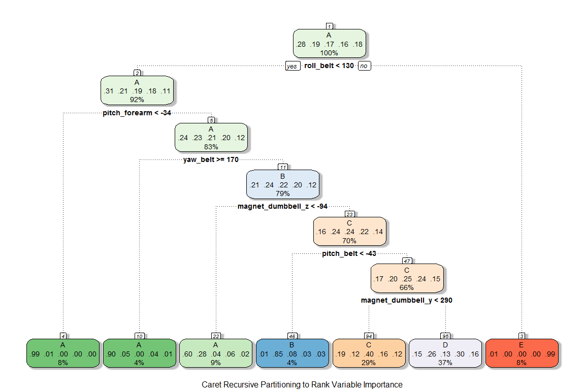
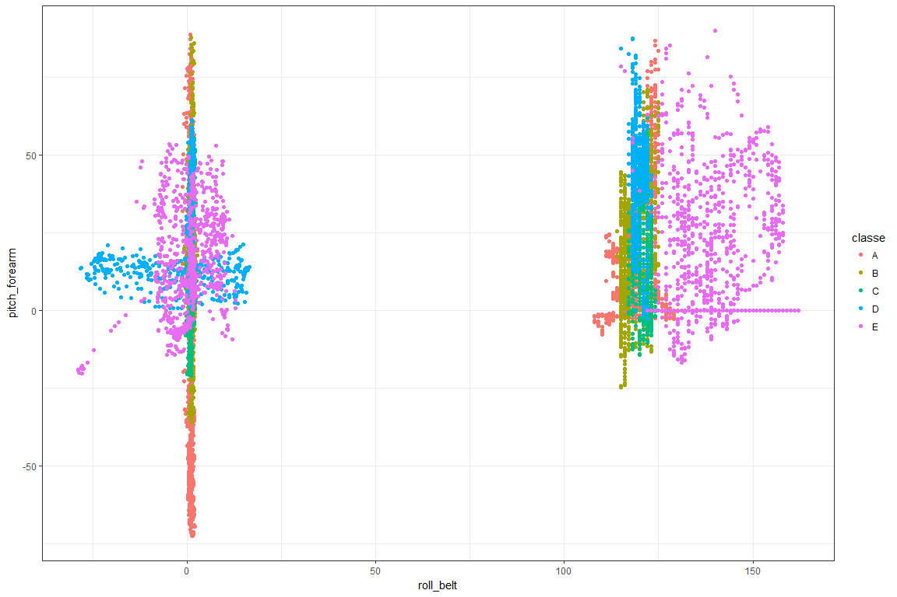
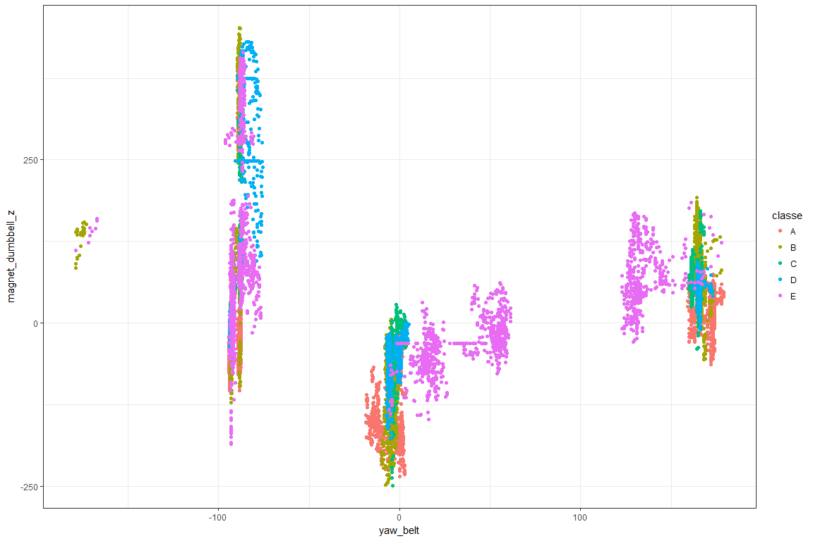

# **Machine Learning for Activity Recognition of Weight Lifting Exercises**

##**Executive Summary**
Machine learning algorithms were used to analyze sensor data collected from six weightlifters performing dumbbell biceps curl exercises. Data were collected from three wearable sensors (on arm, forearm, and belt) and one dumbbell sensor.  The weightlifting participants performed the exercises in five distinct styles under the supervision of a trainer. The weightlifting style was classified as Class A for the correct form, and Class B, C, D, and E for different improper forms.  

The objective of this study was to determine if it was possible to use the sensor data and machine learning algorithms to predict the five distinct styles of weight lifting.  Recursive partition and random forest algorithms were applied. The random forest algorithm was cross validated and found to have 98.3% accuracy for predicting the weightlifting style.  The final random forest model included at least one measurement from each of the four sensors used.

##**Source Data and Previous Research** 

Further description of the weightlifting exercise study and the source data can be found at http://groupware.les.inf.puc-rio.br/ha .  The study was published in 2013:

Velloso, E.; Bulling, A.; Gellersen, H.; Ugulino, W.; Fuks, H. Qualitative Activity Recognition of Weight Lifting Exercises. Proceedings of 4th International Conference in Cooperation with SIGCHI (Augmented Human '13) . Stuttgart, Germany: ACM SIGCHI, 2013.


##**Data Preparation** 
The data file "pml-training.csv" was used for model building and cross validation. The data file "pml-testing.csv" contained the 20 question prediction quiz set for testing.

The weightlifting style, or outcome, was designated as "classe" in the training data.  The dataset was prepared for analysis by removing columns containing the user name, date, and window information that were not sensor data.  In addition, sensor variables that were missing more than 50% of the measurement values were removed prior to analysis.  


```r
# Load libraries
library(caret)
library(rattle)
library(ggplot2)

# Read and clean data
        training <- read.csv("pml-training.csv", na.strings = c("NA", "#DIV/0!"))
        test2 <- read.csv("pml-testing.csv", na.strings = c("NA", "#DIV/0!"))

# Remove columns that are not variables
# user_name and dates are not relevant factors for generalized predictions
        training <- training[, -(1:7)]
        test2  <- test2[, -(1:7)]

# Remove column variables where > 50% of data is missing
        sparse  <- apply(is.na(training), 2, sum) > (dim(training)[1] * 0.5) 
        training <- training[!sparse]
        test2  <- test2[!sparse]  
```

To enable cross validation, the training dataframe was then partitioned using the 60% / 40% recommendation.  The resulting dataframes for the analysis were:

* "train", a subset of the original training data used to create machine learning models

* "test1", a subset of the original training data used for cross validation and accuracy calculations

* "test2", data for the 20 question prediction quiz set for Coursera


```r
        set.seed(123)
        inTrain <- createDataPartition(y=training$classe, p=0.60, list=FALSE)
        train  <- training[inTrain, ]
        test1  <- training[-inTrain, ]        
```
The train data frame was checked for near zero covariates. No near zero variates were expected or found for this continuous measurement data.


```r
        nzv <- nearZeroVar(train) 
        if(length(nzv) > 0) {
                train <- train[,-nzv]
                test1 <- test1[,-nzv]
                test2 <- test2[,-nzv]
        }                
```

##**Variable Importance and Recursive Partitioning** 

Following data preparation, 52 sensor measurements and 1 outcome remained in the data frame. In order to build simpler models with lower computation times, it was necessary to reduce the number of variables.  A recursive partitioning classification tree was used to rank variable importance in a computationally efficient manner.   The analysis was performed using the "rpart" method in the caret library.  


```r
        set.seed(123)
        mrp <- train(classe ~ ., data = train, method = "rpart") 
        mrp_test1 <- predict(mrp, test1)
        confusionMatrix(mrp_test1, test1$classe)
```

```
## Confusion Matrix and Statistics
## 
##           Reference
## Prediction    A    B    C    D    E
##          A 1356  239   42   68   20
##          B    5  264   34    8    6
##          C  441  263  907  397  269
##          D  422  752  385  813  510
##          E    8    0    0    0  637
## 
## Overall Statistics
##                                          
##                Accuracy : 0.5069         
##                  95% CI : (0.4958, 0.518)
##     No Information Rate : 0.2845         
##     P-Value [Acc > NIR] : < 2.2e-16      
##                                          
##                   Kappa : 0.3865         
##  Mcnemar's Test P-Value : < 2.2e-16      
## 
## Statistics by Class:
## 
##                      Class: A Class: B Class: C Class: D Class: E
## Sensitivity            0.6075  0.17391   0.6630   0.6322  0.44175
## Specificity            0.9343  0.99162   0.7885   0.6846  0.99875
## Pos Pred Value         0.7861  0.83281   0.3983   0.2821  0.98760
## Neg Pred Value         0.8569  0.83344   0.9172   0.9047  0.88821
## Prevalence             0.2845  0.19347   0.1744   0.1639  0.18379
## Detection Rate         0.1728  0.03365   0.1156   0.1036  0.08119
## Detection Prevalence   0.2199  0.04040   0.2902   0.3673  0.08221
## Balanced Accuracy      0.7709  0.58277   0.7258   0.6584  0.72025
```
The confusion table above shows the cross validation results for "test1".  The 51% prediction accuracy using recursive partitioning was poor. However, the algorithm did provide valuable information regarding variable importance. The partition tree below indicates that there were a few dominant measurements that classified the outcome for "classe".


```r
        fancyRpartPlot(mrp$finalModel, sub = "Caret Recursive Partitioning to Rank Variable Importance")
```

<!-- -->

Variable importance was ranked (table below), and the top ten variables from recursive partitioning were used to build an improved model. The ten most important variables included at least one measurement from each of the four sensors used (arm, forearm, belt, dumbbell).


```r
        print(varImp(mrp, surrogates = TRUE, competes = FALSE))
```

```
## rpart variable importance
## 
##   only 20 most important variables shown (out of 52)
## 
##                    Overall
## roll_belt         100.0000
## pitch_forearm      68.0490
## yaw_belt           30.4263
## magnet_dumbbell_z  29.4695
## pitch_belt         27.3009
## magnet_dumbbell_y  24.6763
## pitch_arm           0.2092
## accel_belt_x        0.2064
## magnet_belt_z       0.1809
## accel_dumbbell_y    0.1776
## accel_belt_z        0.1067
## total_accel_belt    0.1058
## magnet_arm_y        0.1051
## gyros_forearm_x     0.1050
## gyros_arm_z         0.1050
## accel_forearm_y     0.1041
## magnet_belt_x       0.1040
## accel_forearm_x     0.1030
## magnet_belt_y       0.1030
## accel_dumbbell_x    0.1026
```

```r
        mrp_top <- as.data.frame(varImp(mrp, surrogates = TRUE, competes = FALSE)$importance)
        mrp_top$names <- row.names(mrp_top)
        b <- order(mrp_top$Overall, decreasing = TRUE)
        mrp_top <- mrp_top[b,]
        mrp_top10 <- mrp_top[1:10,2]
```

The clustering patterns for the top four variables "roll_belt", "pitch_forearm", "yaw_belt" and "magnet_dumbbell_z" are shown below. Note that the proper form of lifting, "classe A", tended to have a tighter measurement distribution for these variables.


```r
        g1 <- (qplot(roll_belt, pitch_forearm, colour=classe, data=train) + theme_bw())
        g1
```

<!-- -->

```r
        g2 <- (qplot(yaw_belt, magnet_dumbbell_z, colour=classe, data=train) + theme_bw())
        g2
```

<!-- -->

##**Random Forest Learning** 

To improve prediction accuracy, a random forest algorithm "rf" in the caret library was applied along with the top ten variates from the previous analysis. The confusion table below shows the cross validation results for "test1".  A high 98.3% prediction accuracy was achieved using the random forest algorithm.    


```r
        set.seed(123)
        mrf <- train(classe ~ roll_belt + pitch_forearm + yaw_belt + magnet_dumbbell_z +  
                pitch_belt + magnet_dumbbell_y + pitch_arm + accel_belt_x + 
                magnet_belt_z + accel_dumbbell_y, data = train, method = "rf", 
                allowParallel=TRUE) 
        mrf_test1 <- predict(mrf, test1)
        confusionMatrix(mrf_test1, test1$classe)
```

```
## Confusion Matrix and Statistics
## 
##           Reference
## Prediction    A    B    C    D    E
##          A 2223   24    3    0    0
##          B    9 1462   18    0    6
##          C    0   20 1334   18    6
##          D    0   11   13 1267    4
##          E    0    1    0    1 1426
## 
## Overall Statistics
##                                           
##                Accuracy : 0.9829          
##                  95% CI : (0.9798, 0.9857)
##     No Information Rate : 0.2845          
##     P-Value [Acc > NIR] : < 2.2e-16       
##                                           
##                   Kappa : 0.9784          
##  Mcnemar's Test P-Value : NA              
## 
## Statistics by Class:
## 
##                      Class: A Class: B Class: C Class: D Class: E
## Sensitivity            0.9960   0.9631   0.9751   0.9852   0.9889
## Specificity            0.9952   0.9948   0.9932   0.9957   0.9997
## Pos Pred Value         0.9880   0.9779   0.9681   0.9784   0.9986
## Neg Pred Value         0.9984   0.9912   0.9947   0.9971   0.9975
## Prevalence             0.2845   0.1935   0.1744   0.1639   0.1838
## Detection Rate         0.2833   0.1863   0.1700   0.1615   0.1817
## Detection Prevalence   0.2868   0.1905   0.1756   0.1651   0.1820
## Balanced Accuracy      0.9956   0.9789   0.9842   0.9905   0.9943
```

##**Conclusion** 

The accuracy from the random forest model was 98.3% using the partitioned training data "test1", and therefore suitable for classification predictions outside of the training data set. The out-of-sample error is defined as the error in classifying the "classe" activity in the "test1"" cross validation.  That is, the out-of-sample error is (1 - accuracy)x100 = (1-.9829)x100 = 1.71%.  The out-of-sample error is also easily calculated outside of the confusion matrix as:


```r
        print(sum(mrf_test1 != test1$classe)/length(test1$classe)*100)
```

```
## [1] 1.707877
```
The classifications for the 20 sample prediction quiz ("test2") were 100% accurate (0% out-of-sample error) and were calculated for submission as follows:


```r
        mrf_test2 <- predict(mrf, test2)
        print(mrf_test2)
```

```
##  [1] B A B A A E D B A A B C B A E E A B B B
## Levels: A B C D E
```

```r
        # End
```
